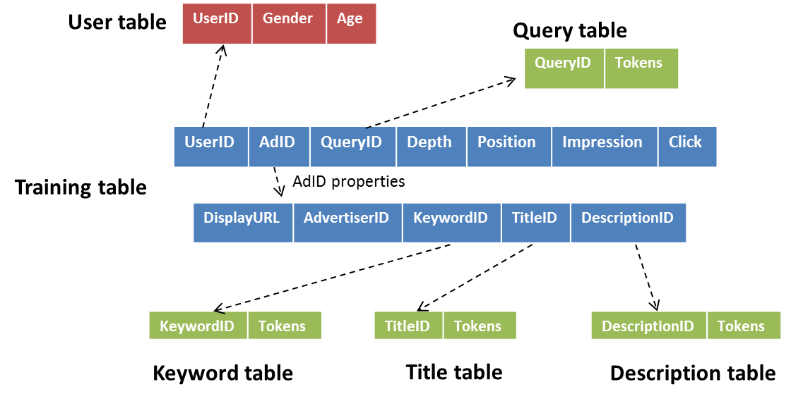

# pCTR
Predict the Click-Through Rate of ads given the query and user information
The data sets are from KDD Cup 2012, Track 2.

## Usage

* View the Zeppelin notebooks online:
  * `note-2`: https://www.zeppelinhub.com/viewer/notebooks/aHR0cHM6Ly9yYXcuZ2l0aHVidXNlcmNvbnRlbnQuY29tL213ODY2L3BDVFIvbWFzdGVyL25vdGUtMi5qc29uP3Rva2VuPUFVTFhpUklHczFpYmxKeF9CSnU1UUZNcFh1OUpyLWZFa3M1Wk55QjF3QSUzRCUzRA
  * `note-3`: https://www.zeppelinhub.com/viewer/notebooks/aHR0cHM6Ly9yYXcuZ2l0aHVidXNlcmNvbnRlbnQuY29tL213ODY2L3BDVFIvbWFzdGVyL25vdGUtMy5qc29uP3Rva2VuPUFVTFhpYXJsR0lfQnNXbEJ5S1RKcnhiREgxTm9CR1Ita3M1Wk55RGt3QSUzRCUzRA
* Run Zeppelin:
  *  `bin/zeppelin-daemon.sh {start|stop|upstart|restart|reload|status}`
  *  Go to [http://localhost:8080](http://localhost:8080/) 
* Run Spark Web UI:

  * http://localhost:4040/jobs/

## Data

### Overview

### Training

| Column Position | Column Name   | Description                              | Format                 |
| --------------- | ------------- | ---------------------------------------- | ---------------------- |
| 0               | Click         | the number of times, among the above impressions, the user (UserID) clicked the ad (AdID) | Integer {0, 1}         |
| 1               | Impression    | the number of search sessions in which the ad (AdID) was impressed by the user (UserID) who issued the query (Query) | Integer {1, 2, 3, 4 …} |
| 2               | DisplayURL    | a property of the ad. The URL is shown together with the title and description of an ad. It is usually the shortened landing page URL of the ad, but not always. In the data file,  this URL is hashed for anonymity | String (fixed length)  |
| 3               | AdID          | ID of the Ad                             | String                 |
| 4               | AdvertiserID  | ID of the Advertiser                     | String                 |
| 5               | Depth         | a property of the session.  The number of ads impressed in a session | Integer {1, 2, 3}      |
| 6               | Position      | a property of an ad in a session.  The order of an ad in the impression list | Integer {1, 2, 3}      |
| 7               | QueryID       | id of the query. This id is a zero‐based integer value. It is the key of the data file 'queryid_tokensid.txt'. | String                 |
| 8               | KeywordID     | id the keyword. This is the key of  'purchasedkeyword_tokensid.txt'. | String                 |
| 9               | TitleID       | a property of ads. This is the key of 'titleid_tokensid.txt'. | String                 |
| 10              | DescriptionID | a property of ads.  This is the key of 'descriptionid_tokensid.txt'. | String                 |
| 11              | UserID        | This is the key of 'userid_profile.txt'.  When we cannot identify the user, this field has a special value of 0. | String                 |

### Test

The testing dataset shares the same format as the training dataset, except for the counts of ad impressions (**Impression**) and ad clicks (**Click**) that are needed for computing the empirical CTR. 

## Reference

### Data

* The original Kaggle competition: https://www.kaggle.com/c/kddcup2012-track2#description
* Apache Hivemall solution: http://hivemall.incubator.apache.org/userguide/regression/kddcup12tr2.html
* Position-Normalized Click Prediction in Search Advertising: http://dl.acm.org/citation.cfm?id=2339654
* CTR Definition: https://support.google.com/adwords/answer/2615875?hl=en
 * A Two-Stage Ensemble of Diverse Models for Advertisement Ranking in KDD Cup 2012: www.csie.ntu.edu.tw/~htlin/paper/doc/wskdd12cup.pdf  		

### Zeppelin

* Install Interpreters: http://zeppelin.apache.org/docs/0.7.1/manual/interpreterinstallation.html
* Enable Git storage in `zeppelin-site.xml`. Remember to copy `conf/zeppelin-site.xml.template` to  `conf/zeppelin-site.xml`: https://zeppelin.apache.org/docs/0.5.6-incubating/storage/storage.html#Git
* Change default interpretor: http://stackoverflow.com/questions/33834401/apache-zeppelin-set-default-interpreter
* Setting up Zeppelin for Pyspark: http://blog.ditullio.fr/2015/11/16/setting-up-zeppelin-for-spark-in-scala-and-python/

### AWS EMR

* AWS EMR Management Guide: http://docs.aws.amazon.com/emr/latest/ManagementGuide/emr-what-is-emr.html

### Spark

* Examples
  * Basic Pyspark Dataframe operations: https://github.com/apache/spark/blob/master/examples/src/main/python/sql/basic.py

## Troubleshooting

### Zeppelin Timeout after 5minuts

Increase `spark.sql.broadcastTimeout` in the config:

`spark = SparkSession.builder.appName("pCTR").config("spark.sql.broadcastTimeout", "600").getOrCreate()	`

http://spark.apache.org/docs/latest/sql-programming-guide.html#other-configuration-options
